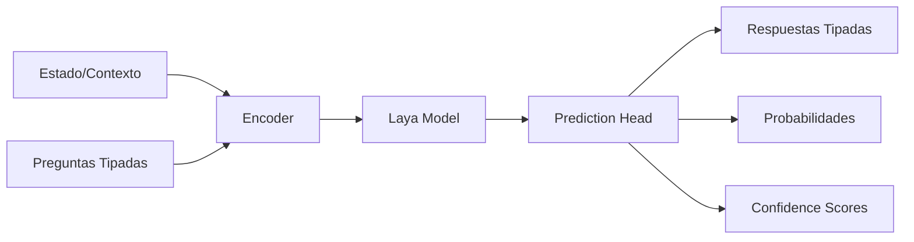
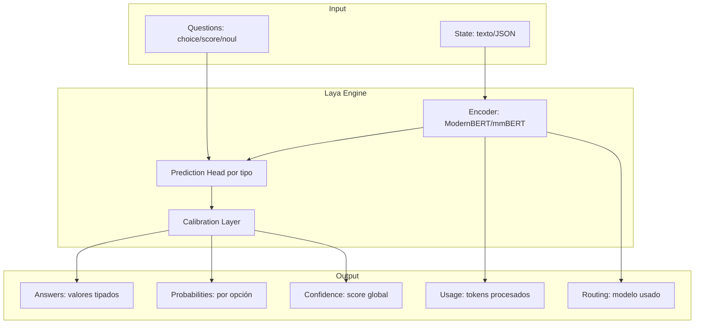
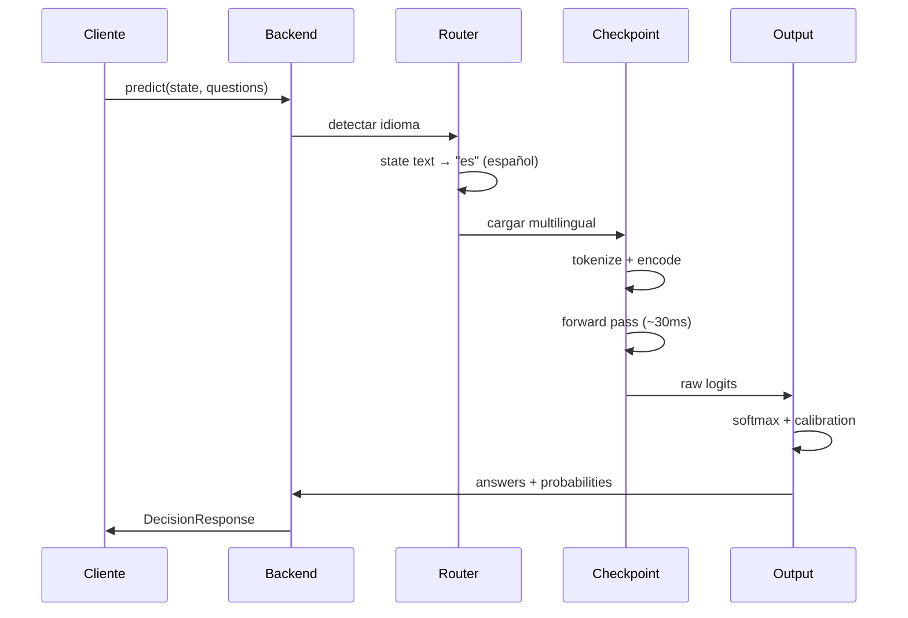
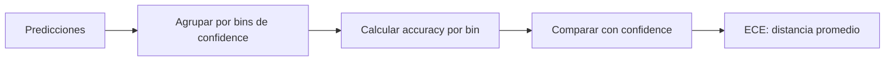

# ¿Qué es Laya?

## Introducción

**Laya** es un modelo de decisión no-autorregresivo de tipo System 1 que evalúa preguntas tipadas sobre un estado (texto, JSON, email, ticket) y retorna respuestas tipadas con probabilidades matemáticamente calibradas en un solo forward pass.

### Características Principales

- **No genera texto**: Elimina errores de parsing y alucinaciones
- **Ultra-rápido**: ~33ms por decisión completa
- **Multilingüe**: Soporta 100+ idiomas incluyendo español
- **Calibrado**: Entrenado con RLCD (RL against strictly proper scoring rules)
- **Open-source**: Apache-2.0, alternativa a Jev de TypeSafe AI

## Arquitectura de Laya

### Flujo de Ejecución



### Componentes Principales



## Checkpoints Disponibles

Laya tiene 3 checkpoints especializados:

| Checkpoint | Encoder | Params | Context | Mejor para |
|------------|---------|--------|---------|------------|
| `english` (default) | ModernBERT-large | 421M | 512 | Inglés, guardrails, email triage |
| `multilingual` | mmBERT-base | 322M | 1024 | 100+ idiomas, español, ~2.2x más rápido |
| `typed-decisions` | ModernBERT-large | 421M | 1024 | Workflows typed-decisions (0.766 acc) |

**Recomendación**: Usar `Router` en producción, que detecta el idioma automáticamente y selecciona el checkpoint óptimo.

## Router vs. Agent Directo

### Router (Recomendado)

```python
import laya

router = laya.Router(default="multilingual", device="cpu")
result = router.predict(state, questions)
# Router detecta español y usa checkpoint multilingual
```

**Ventajas:**
- Detección automática de idioma (<1ms)
- Selección óptima de checkpoint por request
- Mejor experiencia en producción multilingüe

### Agent Directo

```python
agent = laya.load("convaiinnovations/laya", subfolder="multilingual")
result = agent.predict(state, questions)
```

**Ventajas:**
- Control explícito del checkpoint
- Útil para experimentación
- Menor overhead (~1-2ms)

## Tipos de Preguntas

### 1. Choice (Selección)

Elegir una opción entre varias alternativas.

```python
{
    "type": "choice",
    "instructions": "¿A qué categoría pertenece este ticket?",
    "criteria": {
        "facturación": "Pagos, facturas, reembolsos, cobros",
        "técnico": "Bugs, errores, problemas del sistema",
        "ventas": "Consultas comerciales, demos, contratos",
        "otro": "Todo lo demás"
    }
}
```

**Output:**
```python
{
    "choice": "facturación",
    "confidence": 0.87,
    "probabilities": {
        "facturación": 0.87,
        "técnico": 0.08,
        "ventas": 0.03,
        "otro": 0.02
    }
}
```

### 2. Score (Ordinal)

Asignar un valor ordinal en una escala.

```python
{
    "type": "score",
    "instructions": "¿Qué tan urgente es este ticket?",
    "criteria": [
        "No urgente - puede esperar varios días",
        "Urgencia media - responder en 24-48h",
        "Crítico - requiere atención inmediata"
    ]
}
```

**Output:**
```python
{
    "score": 2.0,  # Índice 0-2 (float)
    "confidence": 0.92
}
```

### 3. Noul (Probabilidad Sí/No)

Probabilidad de que algo sea verdadero.

```python
{
    "type": "noul",
    "instructions": "¿El cliente amenaza con cancelar?"
}
```

**Output:**
```python
{
    "noul": 0.78,  # P(true) = 78%
    "confidence": 0.85
}
```

## Flujo de Datos Completo



## Calibración de Probabilidades

Laya está entrenado con **RLCD** (Reinforcement Learning against Strictly Proper Scoring Rules), lo que significa:

1. **Proper scoring rules**: El modelo maximiza reward reportando probabilidades honestas
2. **Brier Score**: Penaliza predicciones sobre/sub-confiadas
3. **Calibración**: P(correcto | confidence=0.8) ≈ 0.8

### Validación de Calibración



**ECE (Expected Calibration Error)**: Mide qué tan bien calibradas están las probabilidades.

```
ECE = Σ (weight_bin * |accuracy_bin - confidence_bin|)
```

- ECE < 0.05: Excelente calibración
- ECE < 0.10: Buena calibración
- ECE > 0.15: Calibración pobre

## Comparación: Laya vs. LLMs Generativos

| Aspecto | Laya | LLM (GPT-4, Claude) |
|---------|------|---------------------|
| **Latencia** | ~33ms | 500-2000ms |
| **Costo** | Gratis (local) / $0.001 (hosted) | $0.01-0.10 por request |
| **Output** | Tipado, estructurado | Texto libre, requiere parsing |
| **Calibración** | Matemática (RLCD) | Débil, no calibrado |
| **Parsing errors** | Cero (no genera texto) | Frecuentes (JSON inválido, etc.) |
| **Consistencia** | Alta (mismo input → mismo output) | Variable (sampling) |
| **Fine-tuning** | ~1000 ejemplos | ~10,000+ ejemplos |
| **Best for** | Decisiones rápidas, routing, clasificación | Razonamiento complejo, generación |

## Casos de Uso Ideales

### ✅ Casos Ideales para Laya

- **Triage de tickets**: Categoría, urgencia, routing
- **Clasificación de emails**: Spam, departamento, prioridad
- **Moderación de contenido**: Detección de violaciones
- **Routing inteligente**: Chatbot → humano vs. automatizado
- **Guardrails**: Validación de inputs/outputs de LLMs
- **Intent detection**: Reconocimiento de intención en NLU
- **Sentiment scoring**: Análisis ordinal de sentimiento
- **Clasificación de documentos**: Tipo, categoría, sensibilidad

### ❌ Casos NO Recomendados

- **Generación de texto**: Usar LLMs
- **Razonamiento complejo**: Chain-of-thought con LLMs
- **Tareas abiertas**: "Explica por qué..." → LLMs
- **Muchas opciones (>20)**: Consider retrieval + Laya
- **Contexto muy largo (>8k tokens)**: Usar LLMs largos

## Laya vs. Jev (TypeSafe AI)

**Jev** es el modelo de decisión comercial de TypeSafe AI (cerrado, de pago). Laya es una alternativa open-source que implementa el mismo contrato `/v1/systemone`.

| | Laya | Jev |
|-|------|-----|
| **Licencia** | Apache-2.0 (open) | Cerrado, propietario |
| **Costo** | Gratis (local) | $0.001-0.01 por request |
| **Deploy** | Local o hosted | Solo API cloud |
| **Latencia** | ~33ms (local) | ~50-100ms (API) |
| **Privacy** | Datos locales | Envía datos a TypeSafe |
| **Customización** | Fine-tuning completo | Limited (via API) |

**Compatibilidad**: Este proyecto soporta ambos backends (ver `docs/06-comparar-con-jev.md`).

## Próximos Pasos

- **[Cómo Preguntar](02-como-preguntar.md)**: Guía de diseño de preguntas efectivas
- **[Métricas](03-metricas.md)**: Entender las métricas de evaluación
- **[PoC 1](04-poc1-benchmark.md)**: Ejecutar benchmarks offline
- **[PoC 2](05-poc2-triage.md)**: Implementar triage de tickets
