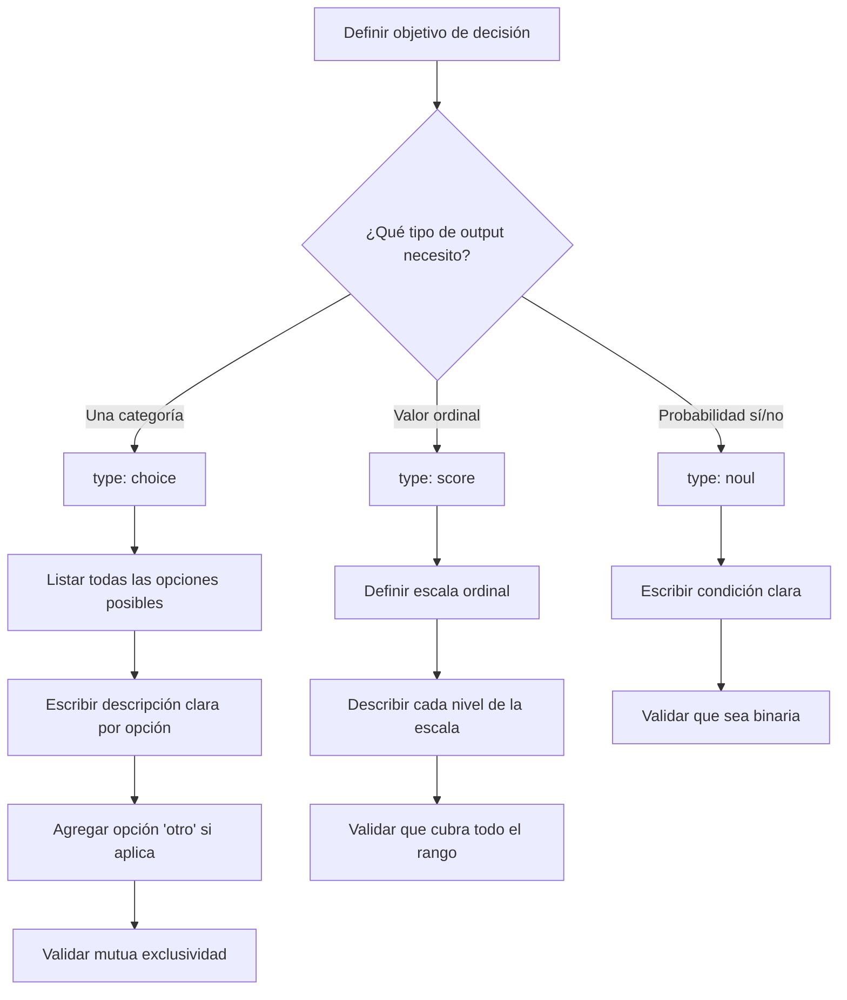
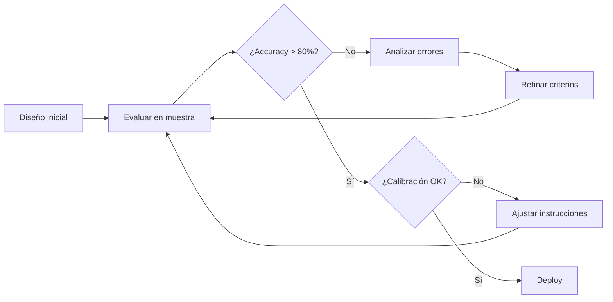

# Cómo Preguntar: Guía de Prompting para Laya

## Introducción

El diseño de preguntas (prompting) es crítico para obtener predicciones precisas de Laya. A diferencia de LLMs generativos, Laya requiere **preguntas estructuradas** con instrucciones claras y criterios bien definidos.

## Principios Fundamentales

### 1. Claridad sobre Creatividad

**❌ Mal:** Instrucciones vagas
```python
{
    "type": "choice",
    "instructions": "¿Qué tipo de cosa es esto?",
    "criteria": {
        "cosa1": "algo",
        "cosa2": "otra cosa"
    }
}
```

**✅ Bien:** Instrucciones específicas
```python
{
    "type": "choice",
    "instructions": "¿A qué categoría de producto pertenece este ítem?",
    "criteria": {
        "electrónica": "Dispositivos electrónicos, computadoras, teléfonos",
        "ropa": "Prendas de vestir, calzado, accesorios",
        "alimentos": "Comida, bebidas, suplementos"
    }
}
```

### 2. Criterios Exhaustivos y Mutuamente Exclusivos

**❌ Mal:** Criterios ambiguos o superpuestos
```python
{
    "criteria": {
        "urgente": "necesita atención rápida",
        "importante": "es importante",
        "crítico": "muy importante"  # Se superpone con "importante"
    }
}
```

**✅ Bien:** Criterios claros sin superposición
```python
{
    "criteria": {
        "bajo": "Puede esperar más de 7 días sin impacto",
        "medio": "Debe resolverse en 2-7 días",
        "alto": "Requiere atención en 24-48 horas",
        "crítico": "Bloquea operaciones, atención inmediata"
    }
}
```

### 3. Incluir Opción "Otro" o "Ninguno"

**✅ Buena práctica:**
```python
{
    "criteria": {
        "facturación": "Pagos, cobros, facturas, reembolsos",
        "técnico": "Errores, bugs, problemas del sistema",
        "ventas": "Consultas comerciales, demos, pricing",
        "otro": "Cualquier tema que no encaje en las categorías anteriores"
    }
}
```

## Flujo de Diseño de Preguntas



## Patrones de Diseño por Tipo

### Choice: Preguntas de Selección

#### Patrón 1: Categorización Simple

```python
{
    "type": "choice",
    "instructions": "¿De qué trata principalmente este email?",
    "criteria": {
        "consulta": "El usuario hace una pregunta o solicita información",
        "queja": "El usuario expresa insatisfacción o un problema",
        "agradecimiento": "El usuario felicita o agradece",
        "solicitud": "El usuario pide una acción específica (cambio, cancelación, etc.)",
        "spam": "Contenido no solicitado, promocional o irrelevante"
    }
}
```

#### Patrón 2: Clasificación con Contexto

```python
{
    "type": "choice",
    "instructions": (
        "¿Qué departamento debe manejar este ticket? "
        "Considera el tema principal y la expertise requerida."
    ),
    "criteria": {
        "facturación": (
            "Pagos, facturas, métodos de pago, reembolsos, cargos, "
            "suscripciones, precios cobrados"
        ),
        "soporte_técnico": (
            "Errores del sistema, bugs, problemas de acceso, "
            "integraciones, API, performance"
        ),
        "éxito_del_cliente": (
            "Onboarding, capacitación, adopción de features, "
            "consultas de uso, mejores prácticas"
        ),
        "ventas": (
            "Consultas pre-venta, demos, nuevos contratos, upgrades, "
            "pricing, planes"
        )
    }
}
```

#### Patrón 3: Detección de Intent

```python
{
    "type": "choice",
    "instructions": "¿Qué acción intenta realizar el usuario?",
    "criteria": {
        "consultar_saldo": "Preguntar por saldo, estado de cuenta, o balance",
        "realizar_pago": "Pagar factura, hacer transferencia, o abonar",
        "reportar_problema": "Informar error, inconsistencia, o mal funcionamiento",
        "solicitar_soporte": "Pedir ayuda con una funcionalidad o proceso",
        "cancelar_servicio": "Dar de baja, cancelar, o terminar suscripción",
        "otro": "Cualquier otra acción no listada"
    }
}
```

### Score: Preguntas Ordinales

#### Patrón 1: Escala de Urgencia

```python
{
    "type": "score",
    "instructions": "¿Qué tan urgente es atender este caso?",
    "criteria": [
        "No urgente: puede esperar una semana o más sin consecuencias",
        "Moderado: debe atenderse en 2-3 días para evitar inconvenientes",
        "Urgente: requiere atención en 24 horas o hay impacto significativo",
        "Crítico: bloquea operación del cliente, atención inmediata necesaria"
    ]
}
```

#### Patrón 2: Intensidad de Sentimiento

```python
{
    "type": "score",
    "instructions": "¿Qué tan positivo o negativo es el sentimiento del cliente?",
    "criteria": [
        "Muy negativo: enojado, frustrado, amenaza con cancelar",
        "Negativo: insatisfecho, decepcionado, pero sin amenazas",
        "Neutral: tono informativo, sin emoción clara",
        "Positivo: satisfecho, agradecido, contento",
        "Muy positivo: encantado, felicita activamente, recomienda"
    ]
}
```

#### Patrón 3: Nivel de Complejidad

```python
{
    "type": "score",
    "instructions": "¿Qué tan complejo es resolver este ticket?",
    "criteria": [
        "Simple: respuesta estándar, FAQ, auto-servicio",
        "Medio: requiere análisis del caso, pero proceso conocido",
        "Complejo: requiere investigación, escalamiento, o múltiples equipos",
        "Muy complejo: caso único, puede requerir desarrollo o cambio de proceso"
    ]
}
```

### Noul: Preguntas Binarias Probabilísticas

#### Patrón 1: Detección de Riesgo

```python
{
    "type": "noul",
    "instructions": (
        "¿Este cliente está en riesgo de cancelar? "
        "Considera amenazas explícitas, frustración alta, "
        "menciones de competencia, o solicitud de cierre de cuenta."
    )
}
```

#### Patrón 2: Validación de Condición

```python
{
    "type": "noul",
    "instructions": (
        "¿Este mensaje contiene información sensible (PII)? "
        "PII incluye: números de tarjeta, SSN, contraseñas, "
        "direcciones completas, datos médicos."
    )
}
```

#### Patrón 3: Verificación de Criterio

```python
{
    "type": "noul",
    "instructions": (
        "¿El cliente solicita explícitamente un reembolso? "
        "Debe ser una solicitud directa, no solo expresar insatisfacción."
    )
}
```

## Mejores Prácticas

### ✅ DO: Hacer

1. **Ser específico en las instrucciones**
   ```python
   "¿A qué departamento debe enviarse este ticket?"
   # No: "¿De qué se trata?"
   ```

2. **Dar contexto en los criterios**
   ```python
   "facturación": "Pagos, facturas, reembolsos, cargos duplicados"
   # No: "facturación": "billing"
   ```

3. **Usar el idioma del estado**
   - Si `state` está en español → instrucciones en español
   - Si `state` está en inglés → instrucciones en inglés
   - Laya es multilingüe y se adapta

4. **Incluir ejemplos en criterios complejos**
   ```python
   "técnico": "Errores del sistema (ej: error 500, login fallido, datos no sincronizan)"
   ```

5. **Validar mutua exclusividad**
   - Cada ítem debe caer en exactamente una categoría
   - Si hay ambigüedad, agregar opción "ambos" o "mixto"

### ❌ DON'T: Evitar

1. **Criterios vagos o genéricos**
   ```python
   "tipo1": "es del tipo 1"  # ❌ No dice qué ES tipo 1
   ```

2. **Superposición entre criterios**
   ```python
   "urgente": "necesita atención pronta"
   "importante": "necesita atención pronta"  # ❌ Superpuesto
   ```

3. **Demasiadas opciones (>20)**
   - Laya funciona mejor con 3-15 opciones
   - Si hay >20, considerar jerarquía de dos pasos

4. **Instrucciones ambiguas**
   ```python
   "¿Qué tipo de cosa es?"  # ❌ Muy vago
   ```

5. **Asumir conocimiento implícito**
   ```python
   "tipo_A": "A"  # ❌ No explica qué significa A
   ```

## Iteración y Mejora

### Proceso de Refinamiento



### Análisis de Errores Comunes

1. **Baja accuracy**: Criterios poco claros o superpuestos
   - **Solución**: Revisar ejemplos mal clasificados, refinar descripciones

2. **Baja confianza**: Ambigüedad en la pregunta
   - **Solución**: Hacer instrucciones más específicas

3. **Alta confianza + incorrecto**: Criterio mal definido
   - **Solución**: Corregir descripción del criterio

4. **Inconsistencia**: Pregunta depende de interpretación
   - **Solución**: Dar ejemplos concretos en instrucciones

## Ejemplos Completos: Bueno vs. Malo

### Ejemplo 1: Triage de Tickets

**❌ Versión Mala:**
```python
questions = {
    "category": {
        "type": "choice",
        "instructions": "¿De qué es?",
        "criteria": {
            "billing": "billing",
            "tech": "technical",
            "other": "other stuff"
        }
    }
}
```

**✅ Versión Buena:**
```python
questions = {
    "category": {
        "type": "choice",
        "instructions": (
            "¿A qué departamento debe asignarse este ticket de soporte? "
            "Clasifica según el tema principal que requiere resolución."
        ),
        "criteria": {
            "facturación": (
                "Problemas con pagos, facturas, cobros, métodos de pago, "
                "reembolsos, cargos duplicados, o consultas sobre precios cobrados"
            ),
            "técnico": (
                "Errores del sistema, bugs de software, problemas de acceso, "
                "integraciones que fallan, performance lento, o APIs"
            ),
            "cuenta": (
                "Cambios de configuración, actualización de información, "
                "permisos de usuario, o administración de cuenta"
            ),
            "ventas": (
                "Consultas pre-venta, solicitud de demos, información de planes, "
                "upgrades, o contratos nuevos"
            ),
            "otro": (
                "Cualquier consulta que no encaje claramente en las categorías "
                "anteriores: feedback general, felicitaciones, sugerencias"
            )
        }
    },
    "urgency": {
        "type": "score",
        "instructions": (
            "¿Qué tan urgente es resolver este ticket? "
            "Considera impacto en el cliente y tiempo crítico."
        ),
        "criteria": [
            "Bajo: puede esperar más de 3 días sin afectar al cliente",
            "Medio: debe resolverse en 1-3 días para evitar frustración",
            "Alto: requiere resolución en 24 horas o hay impacto en operaciones",
            "Crítico: bloquea completamente al cliente, requiere atención inmediata"
        ]
    },
    "needs_escalation": {
        "type": "noul",
        "instructions": (
            "¿Este ticket requiere escalamiento a un especialista o supervisor? "
            "Considera: amenazas de cancelación, solicitudes complejas, "
            "clientes VIP, o casos fuera de políticas estándar."
        )
    }
}
```

## Testing de Preguntas

Antes de producción, validar con:

1. **Muestras diversas**: Probar con 50-100 ejemplos reales
2. **Casos edge**: Incluir ejemplos ambiguos o difíciles
3. **Consistencia**: Mismo ejemplo con paráfrasis → misma respuesta
4. **Calibración**: Confianza correlaciona con accuracy

## Próximos Pasos

- **[Métricas](03-metricas.md)**: Entender cómo medir calidad de preguntas
- **[PoC 1](04-poc1-benchmark.md)**: Evaluar preguntas en benchmarks
- **[Buenas Prácticas](07-buenas-practicas.md)**: Patrones avanzados
