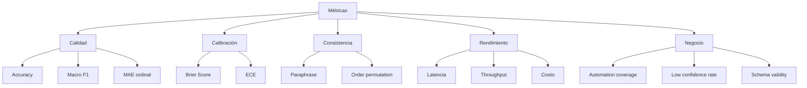
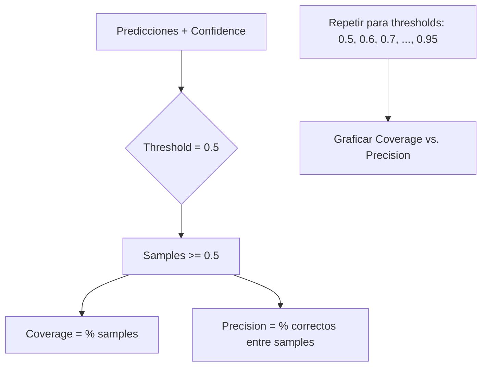

# Métricas de Evaluación

## Introducción

Este documento explica todas las métricas implementadas en `src/metrics/` para evaluar modelos de decisión como Laya.

## Categorías de Métricas



## Métricas de Calidad

### 1. Accuracy (Exactitud)

**¿Qué mide?** Porcentaje de predicciones correctas.

**Fórmula:**
```
Accuracy = (Predicciones correctas) / (Total de predicciones)
```

**Interpretación:**
- `1.0` = 100% correcto (perfecto)
- `0.5` = 50% correcto
- `0.0` = 0% correcto

**Cuándo usar:**
- Preguntas tipo `choice` con clases balanceadas
- Comparar con baselines (mayoría, aleatorio)

**Limitaciones:**
- No considera clases desbalanceadas
- No penaliza falsos positivos/negativos diferente

**Ejemplo:**
```python
predictions = ["facturación", "técnico", "ventas", "técnico"]
labels =      ["facturación", "ventas",  "ventas", "técnico"]
# Correctos: 1 y 4 → 2/4 = 0.50 (50%)
```

**Baseline Mayoría:**
```
Accuracy_majority = (Ejemplos de la clase más frecuente) / (Total)
```

**Baseline Aleatorio:**
```
Accuracy_random = 1 / (Número de clases)
```

### 2. Macro F1 Score

**¿Qué mide?** Promedio de F1 por clase, útil para clases desbalanceadas.

**Fórmula:**
```
Precision = TP / (TP + FP)
Recall = TP / (TP + FN)
F1 = 2 * (Precision * Recall) / (Precision + Recall)
Macro F1 = Promedio(F1 de cada clase)
```

**Interpretación:**
- `1.0` = Perfecto en todas las clases
- `0.5` = Desempeño moderado
- `0.0` = No predice ninguna clase correctamente

**Cuándo usar:**
- Clases desbalanceadas (ej: 80% clase A, 10% clase B, 10% clase C)
- Importa el desempeño en clases minoritarias

**Ventajas sobre Accuracy:**
- No sesgado por clases mayoritarias
- Considera precision y recall

**Ejemplo:**
```python
# 10 muestras: 8 de "A", 1 de "B", 1 de "C"
# Predictor ingenuo: siempre predice "A"
# Accuracy = 8/10 = 0.80 (parece bien)
# Macro F1 = (F1_A + F1_B + F1_C) / 3
#          = (0.89 + 0.0 + 0.0) / 3 = 0.30 (revela problema)
```

### 3. Mean Absolute Error (MAE) para Scores Ordinales

**¿Qué mide?** Error promedio en predicciones de escalas ordinales.

**Fórmula:**
```
MAE = Promedio(|predicción - valor_real|)
```

**Interpretación:**
- `0.0` = Sin error (perfecto)
- `1.0` = Error de 1 nivel en promedio
- `2.0` = Error de 2 niveles en promedio

**Cuándo usar:**
- Preguntas tipo `score` (urgencia: 0-2, sentimiento: 0-4, etc.)
- Cuando el orden importa (2 está más cerca de 1 que de 0)

**Ejemplo:**
```python
# Escala de urgencia: 0 (bajo), 1 (medio), 2 (alto)
predictions = [0, 1, 2, 1]
labels =      [0, 1, 1, 2]
# Errores: |0-0| + |1-1| + |2-1| + |1-2| = 0+0+1+1 = 2
# MAE = 2/4 = 0.5
```

**Contexto:**
- MAE < 0.5: Excelente
- MAE < 1.0: Bueno (error promedio < 1 nivel)
- MAE > 1.5: Pobre

## Métricas de Calibración

### 4. Brier Score

**¿Qué mide?** Error cuadrático medio entre probabilidades predichas y valores reales.

**Fórmula:**
```
Brier = Promedio((probabilidad - valor_real)²)
```

Donde `valor_real` es 0 o 1 (incorrecto o correcto).

**Interpretación:**
- `0.0` = Probabilidades perfectas
- `0.25` = Baseline (siempre predice 0.5)
- `1.0` = Peor caso posible

**Cuándo usar:**
- Evaluar calibración de probabilidades
- Preguntas tipo `noul` (probabilidades 0-1)
- Comparar modelos en confianza

**Ejemplo:**
```python
# Predicciones con probabilidades
probabilities = [0.9, 0.7, 0.3, 0.8]
correct =       [1,   1,   0,   0]
# Brier = ((0.9-1)² + (0.7-1)² + (0.3-0)² + (0.8-0)²) / 4
#       = (0.01 + 0.09 + 0.09 + 0.64) / 4 = 0.2075
```

**Contexto:**
- Brier < 0.10: Excelente calibración
- Brier < 0.20: Buena calibración
- Brier > 0.30: Calibración pobre

**Relación con Accuracy:**
- Brier penaliza sobre-confianza en predicciones incorrectas
- Predictor con 100% accuracy pero confianza baja → Brier alto

### 5. Expected Calibration Error (ECE)

**¿Qué mide?** Diferencia promedio entre confianza predicha y accuracy real por bins.

**Proceso de Cálculo:**


**Fórmula:**
```
ECE = Σ (peso_bin * |accuracy_bin - confidence_bin|)

donde:
  peso_bin = N_bin / N_total
  accuracy_bin = % correctos en el bin
  confidence_bin = confidence promedio en el bin
```

**Bins típicos:** 10 bins de 0.0-0.1, 0.1-0.2, ..., 0.9-1.0

**Interpretación:**
- `ECE < 0.05`: Excelente calibración
- `ECE < 0.10`: Buena calibración
- `ECE > 0.15`: Calibración pobre

**Ejemplo:**
```python
# Bin [0.8-0.9]: 100 muestras
#   - Confidence promedio: 0.85
#   - Accuracy: 0.80 (80 correctos de 100)
#   - Contribución: (100/1000) * |0.80 - 0.85| = 0.1 * 0.05 = 0.005

# Bin [0.9-1.0]: 50 muestras
#   - Confidence promedio: 0.95
#   - Accuracy: 0.92
#   - Contribución: (50/1000) * |0.92 - 0.95| = 0.05 * 0.03 = 0.0015

# ECE = suma de todas las contribuciones
```

**Calibración Perfecta:**
```
En un modelo perfectamente calibrado:
  - Si dice 80% de confianza → 80% de accuracy en ese grupo
  - Si dice 95% de confianza → 95% de accuracy en ese grupo
  → ECE ≈ 0
```

## Métricas de Consistencia

### 6. Paraphrase Consistency

**¿Qué mide?** Consistencia en predicciones cuando el estado se parafrasea.

**Proceso:**
1. Predecir en estado original
2. Parafrasear el estado (mismas preguntas)
3. Predecir en estado parafraseado
4. Calcular % de predicciones idénticas

**Fórmula:**
```
Consistency = (Predicciones idénticas) / (Total de pares)
```

**Interpretación:**
- `1.0` = Siempre consistente (ideal)
- `0.8` = Consistente en 80% de casos
- `0.5` = Inconsistente (50% cambia)

**Ejemplo:**
```python
# Original: "El pago fue rechazado"
# Paráfrasis: "La transacción no se procesó"
# Ambos deberían predecir "facturación"
```

**Uso:**
- Validar robustez del modelo
- Detectar sensibilidad a formulación exacta
- Ideal: >90% de consistencia

### 7. Order Permutation Consistency

**¿Qué mide?** Consistencia cuando se permuta el orden de las opciones en `choice`.

**Proceso:**
1. Predecir con orden A, B, C
2. Predecir con orden C, A, B (permutado)
3. Comparar predicciones

**Fórmula:**
```
Consistency = (Predicciones idénticas) / (Total de permutaciones)
```

**Interpretación:**
- `1.0` = Orden no afecta (ideal)
- `<0.9` = Modelo sesgado por orden

**Uso:**
- Detectar position bias
- Validar que modelo entiende contenido, no posición

## Métricas de Rendimiento

### 8. Latencia (P50, P95, P99)

**¿Qué mide?** Tiempo de respuesta del modelo.

**Percentiles:**
- **P50 (mediana)**: 50% de requests son más rápidos que este valor
- **P95**: 95% de requests son más rápidos (excluye outliers)
- **P99**: 99% de requests son más rápidos (captura casi-outliers)

**Interpretación:**
```
Laya local (CPU):
  - P50: 30-50ms (típico)
  - P95: 60-100ms
  - P99: 100-200ms

Laya HTTP:
  - P50: 50-80ms (+ red)
  - P95: 100-150ms
  - P99: 150-300ms
```

**Cold Start:**
- Primera ejecución: +1-3 segundos (carga modelo)
- Reportar cold start separado de warm runs

**Uso:**
- Evaluar si latencia cumple SLA
- P95/P99 son más importantes que P50 para UX
- Comparar backends (local vs. HTTP)

### 9. Throughput

**¿Qué mide?** Decisiones procesadas por segundo.

**Fórmula:**
```
Throughput = (Total de decisiones) / (Tiempo total en segundos)
```

**Interpretación:**
```
Laya local (CPU, single thread):
  - ~20-30 decisiones/segundo

Laya local (GPU):
  - ~100-200 decisiones/segundo (con batching)

Laya HTTP (shared):
  - Variable según carga
```

**Uso:**
- Planear capacidad
- Evaluar si scale cumple demanda
- Decidir entre local vs. hosted

### 10. Costo por 1000 Decisiones

**¿Qué mide?** Costo económico de operación.

**Cálculo:**
```
Costo = (Costo total) / (Total decisiones) * 1000
```

**Contexto:**
```
Laya local:
  - $0 (solo costo de infraestructura)

Laya hosted (laya.studio):
  - ~$0.10 - $1.00 por 1000 decisiones

Jev (TypeSafe):
  - ~$1.00 - $10.00 por 1000 decisiones
```

**Uso:**
- Comparar backends
- ROI de automatización
- Presupuestar operación

## Métricas de Negocio

### 11. Automation Coverage Curve

**¿Qué mide?** Relación entre umbral de confianza, cobertura (% automatizado) y precisión.

**Proceso:**



**Ejemplo de Curva:**

| Threshold | Coverage | Precision |
|-----------|----------|-----------|
| 0.50 | 95% | 75% |
| 0.60 | 90% | 80% |
| 0.70 | 85% | 85% |
| 0.75 | 75% | 88% |
| 0.80 | 60% | 92% |
| 0.85 | 45% | 95% |
| 0.90 | 30% | 97% |
| 0.95 | 15% | 99% |

**Interpretación:**
- **Umbral bajo (0.5)**: Automatiza mucho pero con más errores
- **Umbral alto (0.9)**: Automatiza poco pero casi sin errores
- **Sweet spot**: Balance entre coverage y precision (ej: 0.75 → 75% coverage, 88% precision)

**Uso:**
- Definir umbral operacional
- Estimar % de casos automatizables a target precision
- Calcular ROI: si automatizas 60% con 95% precision → savings

### 12. Low Confidence Rate

**¿Qué mide?** Porcentaje de decisiones con baja confianza.

**Fórmula:**
```
Low_Conf_Rate = (Predicciones con confidence < umbral) / (Total)
```

**Umbral típico:** 0.7

**Interpretación:**
- `<10%`: Modelo muy confiado (bueno si calibrado)
- `10-30%`: Normal para casos complejos
- `>50%`: Modelo inseguro o preguntas mal diseñadas

**Uso:**
- Detectar preguntas ambiguas
- Estimar carga de escalamiento humano
- Validar calidad de criterios

### 13. Schema Validity

**¿Qué mide?** Porcentaje de respuestas que cumplen el schema esperado.

**Validaciones:**
- `choice`: Respuesta está en `criteria`
- `score`: Respuesta en rango 0-(N-1)
- `noul`: Respuesta entre 0.0-1.0

**Interpretación:**
- `1.0` = Todas válidas (esperado en Laya)
- `<1.0` = Problema de parsing o backend

**Uso:**
- Validar integridad de pipeline
- Comparar backends (LLMs pueden fallar, Laya no debería)

## Confidence Intervals (Intervalos de Confianza)

Usamos **bootstrap** para calcular intervalos de confianza 95%.

**Proceso:**
1. Tomar N muestras con reemplazo del dataset original
2. Calcular métrica en cada muestra
3. Percentiles 2.5% y 97.5% = intervalo 95%

**Ejemplo:**
```python
Accuracy: 0.85 (95% CI: 0.78-0.91)
```

**Interpretación:**
- Hay 95% de probabilidad de que accuracy real esté entre 0.78 y 0.91
- CI estrecho → muestra grande, estimación precisa
- CI amplio → muestra pequeña o alta varianza

## Resumen: ¿Qué Métricas Usar?

### Para Clasificación (choice)
```
Primarias:
  - Accuracy (con baselines)
  - Macro F1 (si clases desbalanceadas)
  - Brier Score (calibración)
  - ECE (calibración)

Secundarias:
  - Consistency (paraphrase + order)
  - Latencia P95
  - Automation coverage
```

### Para Scores Ordinales (score)
```
Primarias:
  - MAE (ordinal)
  - Exact match accuracy

Secundarias:
  - Correlation con humanos
  - Latencia
```

### Para Probabilidades (noul)
```
Primarias:
  - Brier Score
  - Accuracy (threshold=0.5)
  - Calibration plot

Secundarias:
  - AUC-ROC
  - Latencia
```

## Próximos Pasos

- **[PoC 1](04-poc1-benchmark.md)**: Ver métricas en benchmarks reales
- **[PoC 2](05-poc2-triage.md)**: Aplicar métricas a caso de uso
- **[Buenas Prácticas](07-buenas-practicas.md)**: Interpretación avanzada
