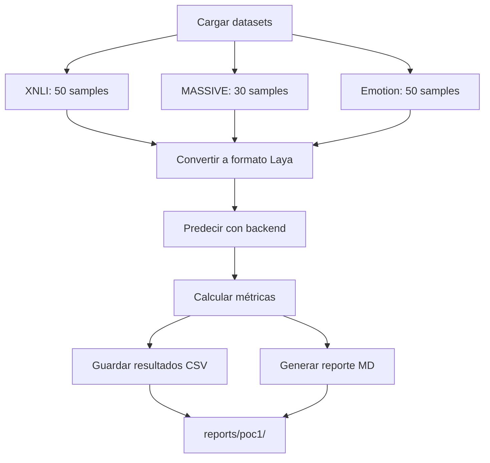

# PoC 1: Benchmark Offline

## Objetivo

Evaluar Laya en datasets públicos estándar para medir su desempeño en tareas de clasificación en inglés y español.

## Datasets Evaluados

### 1. XNLI Spanish (Entailment)

**Descripción:** Natural Language Inference en español.

**Tarea:** Clasificar relación entre premisa e hipótesis:
- `entailment`: La hipótesis se deriva de la premisa
- `neutral`: Compatible pero no se deriva
- `contradiction`: Contradice la premisa

**Tamaño:** 50 muestras del validation set

**Ejemplo:**
```
Premisa: "Un hombre está tocando la guitarra en el parque"
Hipótesis: "Un hombre está tocando música"
Label: entailment
```

### 2. MASSIVE Spanish (Intent Classification)

**Descripción:** Intent detection en español (Amazon Science).

**Tarea:** Clasificar la intención del usuario en 60 categorías.

**Tamaño:** 30 muestras del test set

**Ejemplo:**
```
Text: "¿Cuánto cuesta enviar un paquete a Madrid?"
Intent: "shipping_cost"
```

### 3. Emotion English

**Descripción:** Clasificación de emociones en texto inglés.

**Tarea:** Clasificar emoción en 6 categorías:
- sadness, joy, love, anger, fear, surprise

**Tamaño:** 50 muestras del test set

**Ejemplo:**
```
Text: "I'm so excited about my new job!"
Emotion: joy
```

## Estructura del Código

```
src/poc1_benchmark/
├── data_loaders.py    # Carga datasets desde HuggingFace
├── runner.py          # Orquestador de benchmarks
└── run.py             # Entry point
```

## Ejecución

```bash
# Ejecutar benchmark completo
make poc1

# O directamente
uv run python -m src.poc1_benchmark.run
```

## Flujo de Evaluación



## Conversión a Formato Laya

### XNLI → Choice Question

```python
state = {
    "premise": "Un hombre está tocando la guitarra en el parque",
    "hypothesis": "Un hombre está tocando música"
}

questions = {
    "entailment": {
        "type": "choice",
        "instructions": "¿Cuál es la relación entre la premisa y la hipótesis?",
        "criteria": {
            "entailment": "La hipótesis se deriva lógicamente de la premisa",
            "neutral": "La hipótesis es compatible pero no se deriva de la premisa",
            "contradiction": "La hipótesis contradice la premisa"
        }
    }
}
```

### MASSIVE → Choice Question

```python
state = {
    "text": "¿Cuánto cuesta enviar un paquete a Madrid?"
}

questions = {
    "intent": {
        "type": "choice",
        "instructions": "¿Cuál es la intención del usuario?",
        "criteria": {
            "shipping_cost": "Intent: shipping_cost",
            "order_status": "Intent: order_status",
            # ... (top 20 intents más frecuentes)
        }
    }
}
```

### Emotion → Choice Question

```python
state = {
    "text": "I'm so excited about my new job!"
}

questions = {
    "emotion": {
        "type": "choice",
        "instructions": "What emotion does this text express?",
        "criteria": {
            "sadness": "expressing sadness, grief, or disappointment",
            "joy": "expressing happiness, joy, or excitement",
            "love": "expressing love, affection, or care",
            "anger": "expressing anger, frustration, or annoyance",
            "fear": "expressing fear, worry, or anxiety",
            "surprise": "expressing surprise or amazement"
        }
    }
}
```

## Métricas Reportadas

Para cada dataset:

### Calidad
- **Accuracy** con intervalo de confianza 95%
- **Macro F1**
- **Baseline mayoría** (comparación)
- **Baseline aleatorio** (comparación)

### Calibración
- **Brier Score**
- **ECE** (Expected Calibration Error)

### Rendimiento
- **Latencia P50, P95, P99** (ms)
- **Throughput** (decisiones/segundo)
- **Costo por 1000 decisiones** (USD)

### Negocio
- **Tasa de baja confianza** (< 0.7)
- **Curva de automatización** (coverage vs. precision por threshold)

## Resultados Esperados

### XNLI Spanish

**Desempeño esperado de Laya multilingual:**
- Accuracy: 70-85%
- Macro F1: 65-80%
- ECE: <0.10 (bien calibrado)
- Latencia P50: 30-50ms

**Comparación con baselines:**
- Baseline mayoría: ~33% (3 clases balanceadas)
- Baseline aleatorio: 33%
- Laya debería superar ambos significativamente

### MASSIVE Spanish

**Desempeño esperado:**
- Accuracy: 40-60% (tarea difícil, 60 clases)
- Macro F1: 35-55%
- ECE: <0.15
- Latencia P50: 35-60ms

**Nota:** Intent classification es más difícil que entailment debido al alto número de clases.

### Emotion English

**Desempeño esperado:**
- Accuracy: 75-90%
- Macro F1: 70-85%
- ECE: <0.08
- Latencia P50: 25-40ms (checkpoint inglés más rápido)

## Estructura de Resultados

```
reports/poc1/
├── xnli_results.csv           # Resultados detallados XNLI
├── massive_results.csv        # Resultados detallados MASSIVE
├── emotion_results.csv        # Resultados detallados Emotion
└── report.md                  # Reporte agregado
```

### Formato CSV

```csv
id,premise,hypothesis,true_label,predicted,confidence,latency_ms,correct
0,"...","",...",entailment,entailment,0.87,32.5,True
1,"...","...",neutral,entailment,0.65,28.3,False
...
```

### Formato Reporte MD

```markdown
# PoC 1: Benchmark Offline - Resultados

**Backend:** laya_local
**Fecha:** 2024-01-15 10:30:00

## XNLI_ES

**Muestras:** 50

### Métricas de Calidad

- **Accuracy:** 0.7800 (95% CI: 0.7234-0.8366)
- **Macro F1:** 0.7654 (95% CI: 0.7098-0.8210)

### Métricas de Calibración

- **Brier Score:** 0.0856
- **ECE:** 0.0634

### Métricas de Rendimiento

- **Latencia P50:** 34.2 ms
- **Latencia P95:** 52.8 ms
- **Latencia P99:** 68.1 ms
- **Throughput:** 28.45 req/s

### Métricas de Negocio

- **Tasa de baja confianza:** 12.0%

**Curva de automatización:**

- Umbral 0.50: cobertura 94.0%, precisión 78.7%
- Umbral 0.60: cobertura 88.0%, precisión 81.8%
- Umbral 0.70: cobertura 76.0%, precisión 86.8%
- Umbral 0.75: cobertura 66.0%, precisión 90.9%
- Umbral 0.80: cobertura 54.0%, precisión 92.6%
...
```

## Análisis de Resultados

### ¿Cómo interpretar?

1. **Accuracy vs. Baselines**
   - Si Laya < baseline mayoría → problema en diseño de preguntas
   - Si Laya ≈ baseline → modelo no está aprendiendo
   - Si Laya >> baseline → modelo funcionando bien

2. **Macro F1 vs. Accuracy**
   - Si F1 << Accuracy → sesgado hacia clases mayoritarias
   - Si F1 ≈ Accuracy → desempeño balanceado

3. **Brier Score**
   - <0.10: Excelente calibración
   - 0.10-0.20: Buena calibración
   - >0.20: Revisar confidence scores

4. **ECE**
   - <0.05: Excelente
   - 0.05-0.10: Bueno
   - >0.10: Calibración pobre

5. **Latencia**
   - P50 < 50ms: Excelente para aplicaciones interactivas
   - P95 < 100ms: Bueno
   - P99 > 200ms: Investigar outliers

6. **Automation Coverage**
   - Threshold 0.75: Típicamente el sweet spot
   - Coverage > 70% con Precision > 85%: Excelente para automatización

## Limitaciones Conocidas

1. **Tamaño de muestra pequeño**
   - 50 muestras → intervalos de confianza amplios
   - Para producción: evaluar en 500-1000+ muestras

2. **Zero-shot**
   - Laya no fue fine-tuned en estos datasets
   - Fine-tuning típicamente mejora accuracy 10-20%

3. **Traducción de instrucciones**
   - Instrucciones genéricas pueden no ser óptimas
   - Iterar diseño de preguntas puede mejorar 5-15%

4. **MASSIVE: Muchas clases**
   - 60 intents → accuracy esperada es menor
   - Considerar jerarquía de 2 niveles para producción

## Mejoras Posibles

1. **Fine-tuning**
   ```bash
   # Entrenar en XNLI completo
   python -m src.finetuning.train \\
       --dataset xnli \\
       --language es \\
       --epochs 3
   ```

2. **Optimización de prompts**
   - Iterar `instructions` y `criteria`
   - A/B testing de diferentes formulaciones

3. **Ensemble**
   - Combinar múltiples checkpoints
   - Voting o averaging de probabilidades

4. **Retrieval-augmented**
   - Para MASSIVE: retrieval top-5 intents → Laya elige

## Próximos Pasos

- **[PoC 2](05-poc2-triage.md)**: Aplicar en caso de uso real
- **[Comparar con Jev](06-comparar-con-jev.md)**: Benchmark head-to-head
- **[Buenas Prácticas](07-buenas-practicas.md)**: Patrones avanzados
