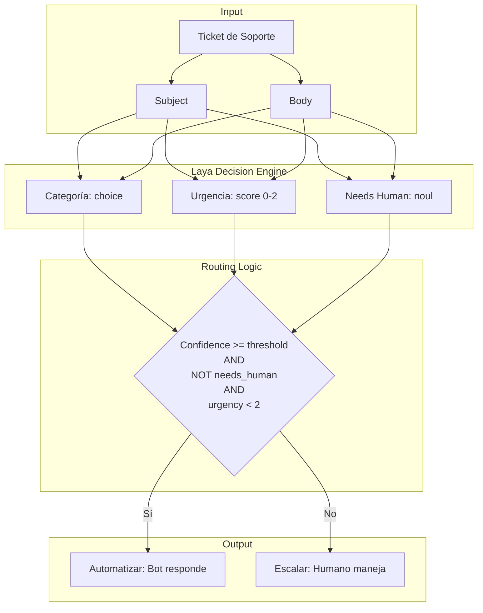
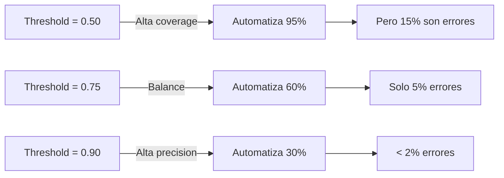
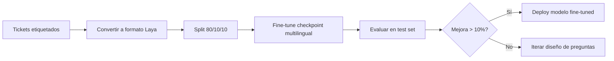

# PoC 2: Triage de Tickets en Shadow Mode

## Objetivo

Simular un sistema de triage automático de tickets de soporte en español, evaluando:
1. **Categorización** (choice)
2. **Scoring de urgencia** (score ordinal)
3. **Detección de necesidad humana** (noul)
4. **Decisión de routing** (automatizar vs. escalar)

## Arquitectura del Sistema



## Dataset Sintético

20 tickets de soporte en español que cubren:

### Categorías (5)
1. **Facturación**: Pagos, cobros, reembolsos
2. **Técnico**: Bugs, errores, integraciones
3. **Ventas**: Consultas comerciales, demos
4. **Cancelación**: Solicitudes de baja, quejas graves
5. **Otro**: Todo lo demás

### Niveles de Urgencia (4)
- **0 (Bajo)**: Puede esperar >3 días
- **1 (Medio)**: Resolver en 1-3 días
- **2 (Alto)**: Atención en 24h
- **3 (Crítico)**: Inmediato, bloqueante

### Needs Human (boolean)
- `True`: Requiere juicio humano, caso complejo, cliente enojado
- `False`: Puede manejarse con respuesta automática

## Ejemplos de Tickets

### Ticket Automatizable

```python
{
    "id": "TKT-002",
    "subject": "Consulta sobre plan premium",
    "body": "Buenos días, me gustaría saber cuáles son las ventajas del plan premium y cuánto cuesta.",
    "category": "ventas",
    "urgency": 0,
    "needs_human": False
}
```

**Decisión:** ✅ Automatizar (respuesta estándar sobre pricing)

### Ticket Escalable

```python
{
    "id": "TKT-006",
    "subject": "Cobro duplicado en mi tarjeta",
    "body": "¡URGENTE! Me cobraron dos veces por el mismo mes. Necesito que devuelvan el cobro duplicado HOY...",
    "category": "facturación",
    "urgency": 2,
    "needs_human": True
}
```

**Decisión:** ⚠️ Escalar (urgente + necesita humano)

## Preguntas Laya

```python
questions = {
    "category": {
        "type": "choice",
        "instructions": "¿A qué categoría pertenece este ticket?",
        "criteria": {
            "facturación": "Pagos, facturas, cobros, reembolsos, métodos de pago",
            "técnico": "Errores, bugs, problemas técnicos, integraciones, API",
            "ventas": "Consultas comerciales, planes, precios, demos, contratos",
            "cancelación": "Solicitudes de cancelación, quejas graves, insatisfacción",
            "otro": "Cualquier otro tema: consultas generales, felicitaciones, cambios de cuenta"
        }
    },
    "urgency": {
        "type": "score",
        "instructions": "¿Qué tan urgente es este ticket?",
        "criteria": [
            "No urgente - puede esperar varios días",
            "Urgencia media - responder en 24-48 horas",
            "Crítico - requiere atención inmediata"
        ]
    },
    "needs_human": {
        "type": "noul",
        "instructions": (
            "¿Este ticket requiere intervención humana especializada? "
            "Considera: amenaza de cancelación, problema crítico, "
            "solicitud compleja, cliente muy insatisfecho, o situación "
            "que requiere juicio humano."
        )
    }
}
```

## Lógica de Routing

```python
def should_automate(prediction, confidence_threshold=0.75):
    """
    Decidir si automatizar o escalar.
    
    Automatizar SI:
      - Confidence de categoría >= threshold (ej: 0.75)
      - needs_human_prob < 0.5 (baja probabilidad de necesitar humano)
      - urgency < 2 (no es crítico)
    
    Caso contrario: Escalar a humano
    """
    category_conf = prediction["category"]["confidence"]
    needs_human_prob = prediction["needs_human"]["noul"]
    urgency = prediction["urgency"]["score"]
    
    return (
        category_conf >= confidence_threshold
        and needs_human_prob < 0.5
        and urgency < 2
    )
```

## Ejecución

```bash
# Ejecutar PoC 2
make poc2

# O directamente
uv run python -m src.poc2_triage.run
```

## Métricas Evaluadas

### 1. Métricas de Clasificación (Categoría)

- **Accuracy**: % de categorías correctas
- **Macro F1**: F1 promedio entre categorías
- **Brier Score**: Calibración de probabilidades
- **Matriz de confusión**: Errores por categoría

### 2. Métricas de Urgencia (Score)

- **MAE (Mean Absolute Error)**: Error promedio en niveles
- **Exact Match Accuracy**: % de scores exactos

### 3. Métricas de Needs Human (Noul)

- **Accuracy**: % de detecciones correctas
- **Precision/Recall**: Falsos positivos/negativos

### 4. Métricas de Automatización

```python
automation_metrics = {
    "total_tickets": 20,
    "automated": 8,  # Tickets que el sistema automatizó
    "should_automate": 10,  # Tickets que DEBERÍAN automatizarse
    "automation_rate": 0.40,  # 40% automatizado
    "automation_precision": 0.875,  # 87.5% de los automatizados son correctos
    "ideal_coverage": 0.50,  # 50% son automatizables
    "incorrectly_automated": 1,  # Escalados erróneamente
    "coverage_gap": 0.10  # 10% de gap (no automatiza todo lo que podría)
}
```

### 5. Matriz de Decisión

| Ground Truth | Decisión Laya | Conteo | Correcto? |
|--------------|---------------|--------|-----------|
| Automatizar | Automatizar | 7 | ✅ |
| Automatizar | Escalar | 3 | ❌ (conservador) |
| Escalar | Automatizar | 1 | ❌ **CRÍTICO** |
| Escalar | Escalar | 9 | ✅ |

**Errores críticos:** Automatizar cuando debería escalar (cliente insatisfecho, urgente, etc.)

## Análisis de Seguridad

### Precision vs. Coverage Trade-off



**Recomendación:** Threshold 0.75-0.80 para balance entre automatización y seguridad.

## Reportes Generados

```
reports/poc2/
├── triage_results.csv     # Resultados detallados por ticket
├── metrics.json           # Métricas en formato JSON
└── report.md              # Reporte narrativo
```

### triage_results.csv

```csv
ticket_id,category_pred,category_true,category_conf,urgency_pred,urgency_true,needs_human_pred,needs_human_true,automate,should_automate,latency_ms
TKT-001,facturación,facturación,0.87,2,2,True,True,False,False,45.2
TKT-002,ventas,ventas,0.92,0,0,False,False,True,True,38.7
...
```

### report.md

```markdown
# PoC 2: Triage de Tickets en Shadow Mode - Resultados

## Resumen Ejecutivo

- **Tickets automatizados:** 8 (40.0%)
- **Precisión de automatización:** 87.5%
- **Cobertura ideal:** 50.0%
- **Gap de cobertura:** 10.0%
- **Tickets incorrectamente automatizados:** 1

## Métricas de Clasificación de Categoría

- **Accuracy:** 0.8500 (95% CI: 0.7234-0.9766)
- **Macro F1:** 0.8123
- **Brier Score:** 0.0923

...
```

## Fine-tuning para Mejorar

El dataset sintético puede usarse para fine-tuning:

```bash
# Preparar datos de entrenamiento
uv run python -m src.poc2_triage.finetuning

# Esto genera: data/poc2_tickets/training_data.jsonl
```

### Proceso de Fine-tuning



**Mejora esperada con fine-tuning:**
- Accuracy: +10-20%
- Brier Score: -0.05 a -0.10
- Coverage: +10-15% al mismo threshold

Ver [`src/poc2_triage/finetuning.py`](../src/poc2_triage/finetuning.py) para detalles.

## Casos de Error Típicos

### 1. Ambigüedad de Categoría

**Ticket:**
```
"Quiero cambiar mi plan a uno más caro pero tengo dudas sobre el pago"
```

**Problema:** ¿Ventas o Facturación?

**Solución:**
- Agregar categoría "mixto" o "múltiple"
- O: Priorizar por acción principal (en este caso: ventas)

### 2. Urgencia Mal Calibrada

**Ticket:**
```
"El sistema está caído completamente desde hace 3 horas"
```

**Ground truth:** Urgencia 2 (crítico)
**Laya predice:** Urgencia 1 (medio)

**Solución:**
- Fine-tuning en más ejemplos críticos
- Refinar criterio de urgencia con keywords ("caído", "bloquea", "inmediato")

### 3. Necesidad Humana No Detectada

**Ticket:**
```
"Esto es el colmo, voy a cancelar y dejar reviews negativas"
```

**Ground truth:** needs_human = True
**Laya predice:** needs_human = False (40%)

**Solución:**
- Agregar ejemplos de amenazas en instrucciones
- Fine-tuning en casos de churn risk

## ROI de Automatización

### Cálculo de Savings

```python
# Asumiendo:
tickets_per_day = 100
human_cost_per_ticket = $2.50 (10 min @ $15/hr)
automation_coverage = 0.60 (60%)
automation_precision = 0.90 (90% correcto)

# Tickets automatizados correctamente
automated_correct = 100 * 0.60 * 0.90 = 54 tickets/día

# Savings
daily_savings = 54 * $2.50 = $135/día
monthly_savings = $135 * 30 = $4,050/mes
yearly_savings = $135 * 365 = $49,275/año

# Costo de Laya local: $0 (solo infra)
# ROI: 100% después de setup inicial
```

### Break-even Analysis

```
Costo de implementación: ~$10,000 (2 semanas dev)
Savings mensuales: $4,050
Break-even: 2.5 meses
```

## Mejores Prácticas para Producción

1. **Shadow Mode Inicial**
   - Ejecutar en paralelo con humanos 2-4 semanas
   - NO automatizar realmente, solo medir

2. **A/B Testing**
   - 10% de tickets → automatización
   - 90% → proceso manual
   - Comparar métricas de satisfacción

3. **Escalamiento Gradual**
   - Semana 1: Automatizar solo confidence > 0.90 (muy seguro)
   - Semana 2-4: Bajar a 0.80
   - Mes 2+: Afinar a 0.75

4. **Monitoreo Continuo**
   - Dashboard de métricas en tiempo real
   - Alertas si precision < 85%
   - Review semanal de casos incorrectamente automatizados

5. **Human-in-the-Loop**
   - Humanos pueden overridear decisión de automatización
   - Feedback loop: errores → fine-tuning

## Próximos Pasos

- **[Comparar con Jev](06-comparar-con-jev.md)**: Benchmark head-to-head
- **[Buenas Prácticas](07-buenas-practicas.md)**: Patrones de producción
- **Fine-tuning**: Entrenar en tus propios tickets reales
