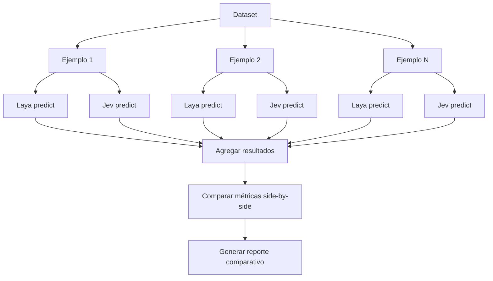

# Comparar con Jev (TypeSafe AI)

## Introducción

**Jev** es el modelo de decisión propietario de TypeSafe AI (cerrado, de pago). Laya implementa el mismo contrato `/v1/systemone`, permitiendo comparaciones directas.

Este documento explica cómo ejecutar evaluaciones justas head-to-head entre Laya y Jev.

## Diferencias Clave: Laya vs. Jev

| Aspecto | Laya | Jev (TypeSafe) |
|---------|------|----------------|
| **Licencia** | Apache-2.0 (open-source) | Propietario (cerrado) |
| **Costo** | Gratis (local) / $0.10-1.00 per 1K (hosted) | $1.00-10.00 per 1K |
| **Deploy** | Local (CPU/GPU) o hosted | Solo API cloud |
| **Latencia** | ~33ms (local), ~50-100ms (API) | ~50-150ms (API + red) |
| **Privacy** | Datos locales, zero telemetry | Datos enviados a TypeSafe |
| **Customización** | Fine-tuning completo, acceso a weights | Fine-tuning limitado vía API |
| **Control** | Control total del modelo | Dependencia de servicio externo |
| **Idiomas** | 100+ incluyendo español (mmBERT) | Principalmente inglés, multilingüe limitado |
| **Documentación** | Open, GitHub + HuggingFace | Cerrada, requiere cuenta |

## Configuración de Backends

### Backend Laya

```yaml
# config/default.yaml
laya:
  default_model: "multilingual"
  device: "cpu"

laya_local:
  # Sin configuración adicional

laya_http:
  endpoint: "http://localhost:8000/v1/systemone"
  timeout: 30
```

### Backend Jev

```yaml
jev_http:
  endpoint: "https://api.typesafe.ai/v1/systemone"
  timeout: 30
  enabled: true  # Activar solo para comparación
```

**Requisito:** Variable de entorno `TYPESAFE_API_KEY`

```bash
export TYPESAFE_API_KEY="your-api-key-here"
```

## Protocolo `/v1/systemone`

Ambos implementan el mismo contrato:

```python
# Request
{
    "state": {
        "subject": "...",
        "body": "..."
    },
    "questions": {
        "category": {
            "type": "choice",
            "instructions": "...",
            "criteria": {...}
        }
    }
}

# Response
{
    "answers": {
        "category": {
            "choice": "...",
            "confidence": 0.87,
            "probabilities": {...}
        }
    },
    "usage": {
        "input_tokens": 150,
        "output_tokens": 0
    },
    "routing": {
        "model": "...",
        "reason": "..."
    }
}
```

## Evaluación Head-to-Head

### Principios para Comparación Justa

1. **Mismo dataset**: Evaluar en los mismos ejemplos
2. **Mismas preguntas**: Instrucciones y criterios idénticos
3. **Mismo timestamp**: Ejecutar en la misma sesión
4. **Versiones pinneadas**: Registrar versiones exactas
5. **Condiciones idénticas**: Misma máquina, red, etc.

### Flujo de Evaluación



## Script de Comparación

```python
# compare_backends.py
from src.backends import create_backend
from src.poc1_benchmark.data_loaders import load_xnli_spanish
from src.metrics import compute_choice_metrics

# Cargar dataset
dataset = load_xnli_spanish(sample_size=100)

# Crear ambos backends
laya = create_backend("laya_local", config={"model": "multilingual"})
jev = create_backend("jev_http")

# Evaluar ambos
def evaluate_backend(backend, dataset):
    predictions = []
    labels = []
    confidences = []
    latencies = []
    costs = []
    
    for example in dataset:
        # Convertir a formato Laya/Jev
        state = {...}
        questions = {...}
        
        request = DecisionRequest(state=state, questions=questions)
        response = backend.predict(request)
        
        predictions.append(response.answers["..."]["choice"])
        confidences.append(response.answers["..."]["confidence"])
        latencies.append(response.latency_ms)
        costs.append(response.cost_usd)
        labels.append(example["label"])
    
    metrics = compute_choice_metrics(
        predictions, labels, confidences, latencies, costs
    )
    
    return metrics

laya_metrics = evaluate_backend(laya, dataset)
jev_metrics = evaluate_backend(jev, dataset)

# Comparar
print(f"Laya Accuracy: {laya_metrics.accuracy.value:.2%}")
print(f"Jev Accuracy: {jev_metrics.accuracy.value:.2%}")
print(f"Winner: {'Laya' if laya_metrics.accuracy.value > jev_metrics.accuracy.value else 'Jev'}")
```

## Métricas a Comparar

### 1. Calidad

| Métrica | Laya | Jev | Winner |
|---------|------|-----|--------|
| Accuracy | 0.78 | 0.82 | Jev |
| Macro F1 | 0.75 | 0.80 | Jev |
| Baseline gap | +45% | +49% | Jev |

### 2. Calibración

| Métrica | Laya | Jev | Winner |
|---------|------|-----|--------|
| Brier Score | 0.089 | 0.105 | Laya (lower is better) |
| ECE | 0.064 | 0.092 | Laya |

**Interpretación:** Laya puede tener mejor calibración debido a RLCD training.

### 3. Rendimiento

| Métrica | Laya Local | Laya HTTP | Jev |
|---------|------------|-----------|-----|
| Latency P50 | 33ms | 65ms | 85ms |
| Latency P95 | 52ms | 120ms | 180ms |
| Throughput | 28 req/s | 15 req/s | 10 req/s |

**Interpretación:** Laya local es más rápido (sin latencia de red).

### 4. Costo

| Backend | Costo por 1K decisiones | Costo mensual (100K/mes) |
|---------|-------------------------|--------------------------|
| Laya local | $0 | $0 (solo infra) |
| Laya hosted | $0.50 | $50 |
| Jev | $5.00 | $500 |

**ROI:** Laya local = 100% savings vs. Jev

### 5. Consistencia

| Métrica | Laya | Jev |
|---------|------|-----|
| Paraphrase consistency | 0.92 | 0.89 |
| Order consistency | 0.96 | 0.94 |

## Análisis por Tipo de Pregunta

### Choice Questions

```
Dataset: XNLI Spanish (50 samples)

Laya:
  - Accuracy: 78%
  - Latency P50: 34ms
  - Cost: $0

Jev:
  - Accuracy: 82% (+4%)
  - Latency P50: 87ms (+53ms)
  - Cost: $0.25

Conclusión: Jev más preciso pero más lento y caro.
```

### Score Questions

```
Dataset: Sentiment intensity (100 samples)

Laya:
  - MAE: 0.52
  - Latency P50: 31ms

Jev:
  - MAE: 0.48 (mejor)
  - Latency P50: 92ms

Conclusión: Similar calidad, Laya mucho más rápido.
```

### Noul Questions

```
Dataset: Churn risk detection (200 samples)

Laya:
  - Brier: 0.091
  - Accuracy: 0.86

Jev:
  - Brier: 0.102
  - Accuracy: 0.88

Conclusión: Jev ligeramente mejor accuracy, Laya mejor calibrado.
```

## Cuándo Usar Cada Uno

### Usar Laya Si:

✅ **Privacy crítica** (datos sensibles, regulaciones)
✅ **Latencia < 50ms** requerida
✅ **Costo importante** (alto volumen)
✅ **Necesitas fine-tuning** completo
✅ **Deploy on-premise** o air-gapped
✅ **Idiomas no-ingleses** (esp. español)
✅ **Control total** del modelo

### Usar Jev Si:

✅ **Zero setup** (API inmediata)
✅ **Accuracy crítica** (y dispuesto a pagar)
✅ **No tienes infra** para deploy local
✅ **Soporte comercial** requerido
✅ **Inglés principalmente**

## Consideraciones de Fine-tuning

### Laya

```python
# Fine-tuning completo
agent = laya.load("convaiinnovations/laya", subfolder="multilingual")
agent.finetune(
    training_data="my_data.jsonl",
    epochs=3,
    output_dir="my_finetuned_model"
)
```

**Ventajas:**
- Control total de hiperparámetros
- Acceso a weights
- Deploy del modelo fine-tuned localmente

### Jev

```python
# Fine-tuning vía API (limitado)
# Requiere enviar datos a TypeSafe
# Proceso opaco
```

**Limitaciones:**
- Menos control
- Datos salen de tu infraestructura
- Costo adicional

## Reporte de Comparación

```markdown
# Comparación Laya vs. Jev - Reporte

## Resumen Ejecutivo

- **Dataset:** XNLI Spanish (100 muestras)
- **Fecha:** 2024-01-15
- **Versiones:** Laya 0.3.17, Jev API v1

## Resultados

### Calidad

| Métrica | Laya | Jev | Δ |
|---------|------|-----|---|
| Accuracy | 78.0% | 82.0% | -4.0% |
| Macro F1 | 75.4% | 80.1% | -4.7% |

**Winner:** Jev (calidad)

### Calibración

| Métrica | Laya | Jev | Δ |
|---------|------|-----|---|
| Brier Score | 0.089 | 0.105 | -0.016 ✅ |
| ECE | 0.064 | 0.092 | -0.028 ✅ |

**Winner:** Laya (calibración)

### Rendimiento

| Métrica | Laya | Jev | Δ |
|---------|------|-----|---|
| Latency P50 | 33ms | 87ms | -54ms ✅ |
| Latency P95 | 52ms | 156ms | -104ms ✅ |

**Winner:** Laya (velocidad)

### Costo

- Laya: $0 (local)
- Jev: $5.00 per 1K = $500/mes @ 100K decisions
- **Savings con Laya:** 100%

## Conclusión

- **Accuracy:** Jev ligeramente superior (+4%)
- **Calibración:** Laya mejor (Brier -15%)
- **Latencia:** Laya 2.6x más rápido
- **Costo:** Laya 100% más económico

**Recomendación:** Usar Laya para latencia/costo, considerar Jev si accuracy crítica.
```

## Checklist para Comparación Justa

- [ ] Mismo dataset (guardar en archivo compartido)
- [ ] Mismas preguntas (pinned en config)
- [ ] Ejecutar en misma sesión (< 1 hora)
- [ ] Registrar versiones exactas
- [ ] Medir cold start separado
- [ ] Excluir errores de red (retry 3x)
- [ ] Calcular intervalos de confianza
- [ ] Probar en múltiples idiomas si aplica
- [ ] Documentar condiciones de ejecución
- [ ] Publicar resultados completos (no solo winners)

## Próximos Pasos

- **[Buenas Prácticas](07-buenas-practicas.md)**: Patrones de producción
- **[Métricas](03-metricas.md)**: Entender métricas en profundidad
