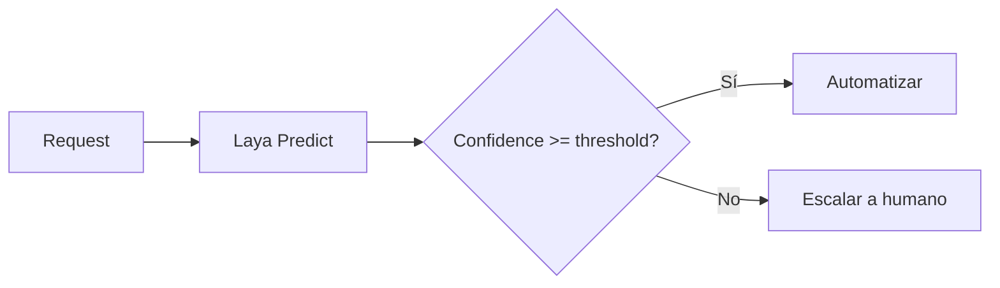
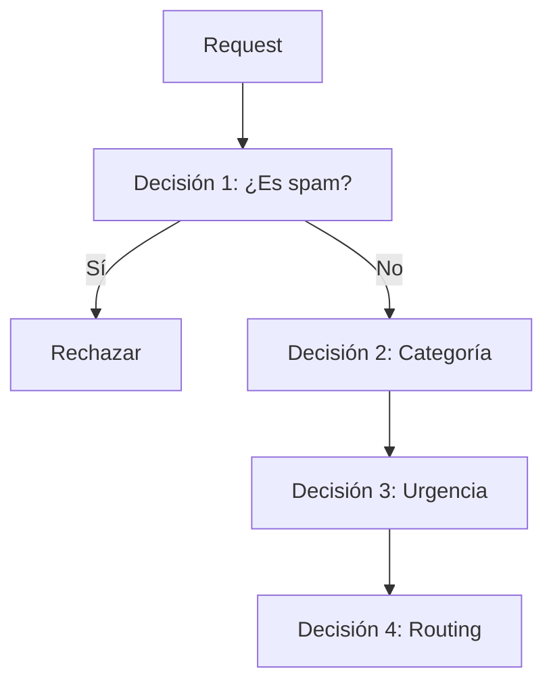
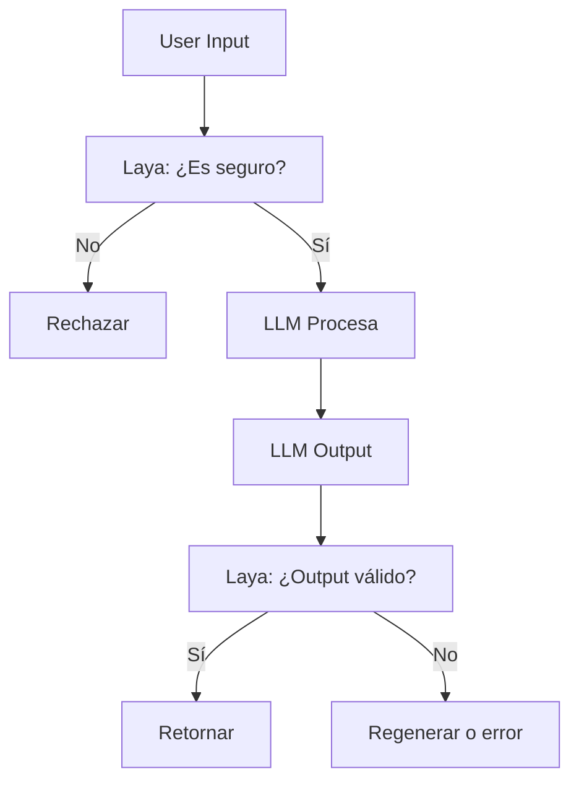
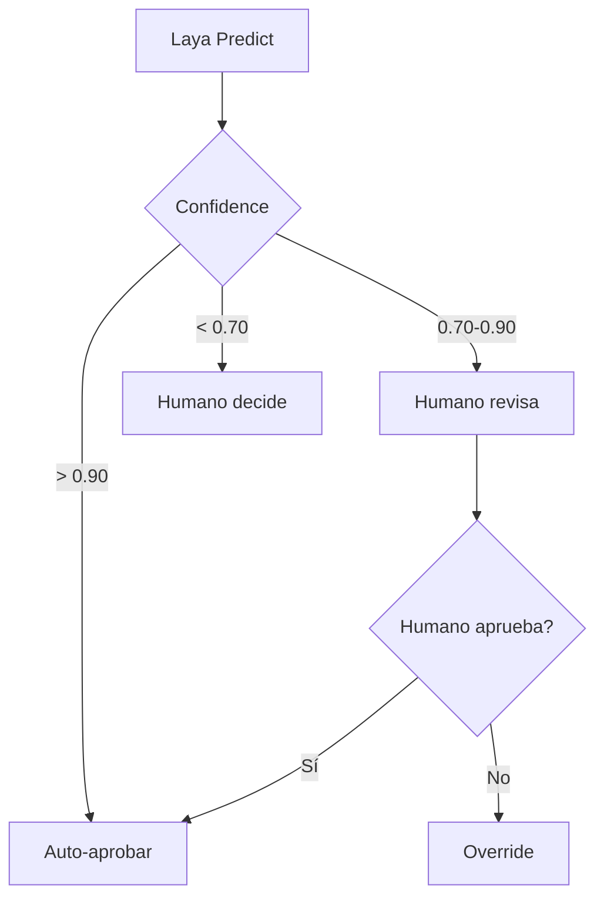
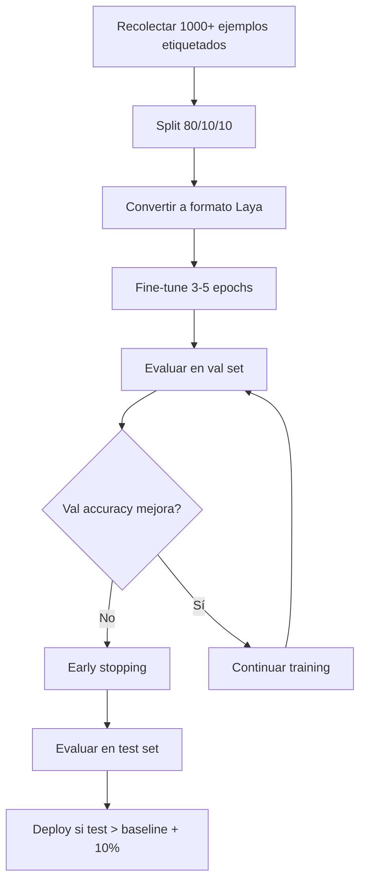

# Buenas Prácticas

## Introducción

Este documento recopila patrones, anti-patrones y recomendaciones para usar Laya en producción.

## Diseño de Preguntas

### ✅ DO: Hacer

#### 1. Instrucciones Específicas y Contextuales

```python
# ✅ BIEN
{
    "instructions": (
        "¿A qué departamento debe asignarse este ticket de soporte? "
        "Clasifica según el tema principal que requiere resolución."
    )
}

# ❌ MAL
{
    "instructions": "¿De qué se trata?"
}
```

#### 2. Criterios Exhaustivos con Descripciones Ricas

```python
# ✅ BIEN
{
    "facturación": (
        "Problemas con pagos, facturas, cobros, métodos de pago, "
        "reembolsos, cargos duplicados, suscripciones, o consultas "
        "sobre precios cobrados. Incluye disputas de cargos."
    )
}

# ❌ MAL
{
    "facturación": "billing stuff"
}
```

#### 3. Incluir Opción "Otro" o "Ninguno"

```python
{
    "criteria": {
        "opción_1": "...",
        "opción_2": "...",
        "opción_3": "...",
        "otro": "Cualquier caso que no encaje claramente en las categorías anteriores"
    }
}
```

#### 4. Validar Mutua Exclusividad

```python
# ✅ BIEN: Mutuamente exclusivo
{
    "bajo": "0-2 días de espera",
    "medio": "3-5 días",
    "alto": "< 2 días, urgente"
}

# ❌ MAL: Superposición
{
    "urgente": "necesita atención rápida",
    "importante": "necesita atención rápida",  # Superpone con urgente
    "crítico": "muy urgente"  # Superpone con urgente
}
```

#### 5. Usar Mismo Idioma que el Estado

```python
# Estado en español → preguntas en español
state = {"subject": "Problema con mi factura"}
questions = {
    "urgency": {
        "instructions": "¿Qué tan urgente es este caso?",  # ✅ Español
        # NO: "How urgent is this case?"  # ❌ Inglés
    }
}
```

### ❌ DON'T: Evitar

#### 1. Demasiadas Opciones (>20)

```python
# ❌ MAL: 50 intents
{"intent": {"criteria": {f"intent_{i}": "..." for i in range(50)}}}

# ✅ BIEN: Jerarquía de 2 niveles
# Nivel 1: 5 categorías amplias
# Nivel 2: Sub-clasificación dentro de categoría elegida
```

#### 2. Ambigüedad o Vaguedad

```python
# ❌ MAL
{"instructions": "¿Qué tipo es?"}

# ✅ BIEN
{"instructions": "¿Qué categoría de producto representa este ítem? (Electrónica, Ropa, Alimentos, etc.)"}
```

#### 3. Asumir Conocimiento del Dominio

```python
# ❌ MAL
{"tipo_A": "A"}  # No explica qué es "A"

# ✅ BIEN
{"tipo_A": "Tipo A: solicitudes de reembolso por defectos de fabricación"}
```

## Arquitectura de Sistema

### Patrón 1: Routing Simple



**Uso:** Triage básico, clasificación simple

### Patrón 2: Cascade de Decisiones



**Uso:** Workflows complejos, decisiones dependientes

### Patrón 3: Guardrails para LLMs



**Uso:** Validación de inputs/outputs de modelos generativos

### Patrón 4: Human-in-the-Loop con Confidence Bands



**Uso:** Incrementar coverage gradualmente, aprendizaje continuo

## Manejo de Confianza

### Bandas de Confianza

```python
def route_by_confidence(prediction):
    conf = prediction["confidence"]
    
    if conf >= 0.90:
        # Alta confianza: automatizar directamente
        return "auto_approve"
    
    elif conf >= 0.75:
        # Confianza media: humano revisa brevemente
        return "human_review"
    
    elif conf >= 0.60:
        # Baja confianza: humano decide de cero
        return "human_decide"
    
    else:
        # Muy baja: no usar predicción
        return "manual"
```

### Calibración en Producción

```python
# Monitorear calibración mensualmente
def check_calibration(predictions, ground_truth):
    """
    Agrupar por bins de confidence y comparar con accuracy real.
    Alertar si ECE > 0.10
    """
    ece = calculate_ece(predictions, ground_truth)
    
    if ece > 0.10:
        send_alert("Calibration degraded: ECE = {:.3f}".format(ece))
```

## Fine-tuning

### Cuándo Fine-tunear

✅ **Sí, fine-tunea si:**
- Tienes 1000+ ejemplos etiquetados de calidad
- Zero-shot accuracy < 70%
- Dominio muy específico (jerga, terminología única)
- Necesitas ganar 10-20% de accuracy

❌ **No, itera diseño de preguntas si:**
- < 500 ejemplos
- Zero-shot accuracy > 85%
- Instrucciones aún no optimizadas

### Proceso de Fine-tuning



### Ejemplo de Fine-tuning

```python
import laya

# Cargar modelo base
agent = laya.load("convaiinnovations/laya", subfolder="multilingual")

# Fine-tune
agent.finetune(
    training_data="data/training.jsonl",
    validation_data="data/validation.jsonl",
    output_dir="models/my_finetuned_laya",
    epochs=3,
    learning_rate=2e-5,
    batch_size=16,
    early_stopping_patience=2
)

# Evaluar
from src.metrics import compute_choice_metrics

test_data = load_test_data()
metrics = evaluate_model(agent, test_data)

if metrics.accuracy > baseline_accuracy + 0.10:
    print("✅ Fine-tuning exitoso, deploy recomendado")
else:
    print("❌ Mejora insuficiente, iterar diseño de preguntas")
```

## Manejo de Errores

### Retry con Backoff

```python
def predict_with_retry(backend, request, max_retries=3):
    """Retry con exponential backoff para errores transitorios."""
    for attempt in range(max_retries):
        try:
            return backend.predict(request)
        except (NetworkError, TimeoutError) as e:
            if attempt < max_retries - 1:
                sleep_time = 2 ** attempt  # 1s, 2s, 4s
                time.sleep(sleep_time)
            else:
                raise
        except (AuthError, RateLimitError) as e:
            # No reintentar errores fatales
            raise
```

### Fallbacks

```python
def predict_with_fallback(primary, fallback, request):
    """Usar backend fallback si primario falla."""
    try:
        return primary.predict(request)
    except Exception as e:
        log.warning(f"Primary backend failed: {e}, using fallback")
        return fallback.predict(request)

# Uso
laya_local = create_backend("laya_local")
laya_http = create_backend("laya_http")  # Fallback

response = predict_with_fallback(laya_local, laya_http, request)
```

### Circuit Breaker

```python
class CircuitBreaker:
    """Abrir circuito si tasa de error supera threshold."""
    
    def __init__(self, failure_threshold=0.5, timeout=60):
        self.failure_threshold = failure_threshold
        self.timeout = timeout
        self.failures = 0
        self.successes = 0
        self.last_failure_time = None
        self.is_open = False
    
    def call(self, func, *args, **kwargs):
        if self.is_open:
            if time.time() - self.last_failure_time > self.timeout:
                # Intentar cerrar circuito
                self.is_open = False
            else:
                raise CircuitOpenError("Circuit breaker is open")
        
        try:
            result = func(*args, **kwargs)
            self.successes += 1
            return result
        except Exception as e:
            self.failures += 1
            self.last_failure_time = time.time()
            
            error_rate = self.failures / (self.failures + self.successes)
            if error_rate > self.failure_threshold:
                self.is_open = True
            
            raise
```

## Monitoreo y Observabilidad

### Métricas Clave a Monitorear

```python
# Dashboard en tiempo real
metrics_to_track = {
    # Calidad
    "accuracy_rolling_7d": 0.85,
    "macro_f1_rolling_7d": 0.82,
    
    # Calibración
    "brier_score_rolling_7d": 0.09,
    "ece_rolling_7d": 0.06,
    
    # Rendimiento
    "latency_p95_1h": 65.3,  # ms
    "throughput_1h": 24.5,  # req/s
    "error_rate_1h": 0.002,  # 0.2%
    
    # Negocio
    "automation_rate_24h": 0.68,  # 68%
    "incorrectly_automated_24h": 12,  # count
    
    # Sistema
    "cpu_usage": 0.45,
    "memory_gb": 2.3,
}
```

### Alertas

```python
# Configurar alertas
alerts = [
    Alert("accuracy_drop", condition="accuracy < 0.75", severity="high"),
    Alert("calibration_drift", condition="ece > 0.10", severity="medium"),
    Alert("high_latency", condition="latency_p95 > 150ms", severity="medium"),
    Alert("error_spike", condition="error_rate > 0.05", severity="critical"),
]
```

### Logging Estructurado

```python
import logging
import json

def log_prediction(request, response, ground_truth=None):
    """Log estructurado de predicciones para análisis posterior."""
    log_entry = {
        "timestamp": time.time(),
        "request_id": request.request_id,
        "state_hash": hash(json.dumps(request.state)),
        "prediction": response.answers,
        "confidence": {
            k: v.get("confidence", 0) for k, v in response.answers.items()
        },
        "latency_ms": response.latency_ms,
        "cost_usd": response.cost_usd,
        "ground_truth": ground_truth,
        "correct": ground_truth == response.answers if ground_truth else None,
    }
    
    logging.info(json.dumps(log_entry))
```

## Testing

### Unit Tests

```python
def test_predict_returns_valid_schema():
    """Validar que respuestas cumplen schema."""
    backend = create_backend("laya_local")
    
    request = DecisionRequest(
        state={"text": "test"},
        questions={
            "category": {
                "type": "choice",
                "criteria": {"a": "...", "b": "..."}
            }
        }
    )
    
    response = backend.predict(request)
    
    assert "category" in response.answers
    assert "choice" in response.answers["category"]
    assert response.answers["category"]["choice"] in ["a", "b"]
    assert 0 <= response.answers["category"]["confidence"] <= 1
```

### Integration Tests

```python
@pytest.mark.integration
def test_end_to_end_triage():
    """Test completo de triage."""
    backend = create_backend("laya_local")
    runner = TicketTriageRunner(backend)
    
    test_ticket = {
        "subject": "Error en pago",
        "body": "...",
        "category": "facturación",
        "urgency": 1,
    }
    
    result = runner.triage_ticket(test_ticket)
    
    assert result["category_pred"] is not None
    assert result["category_conf"] > 0
    assert result["latency_ms"] > 0
```

### A/B Testing

```python
def ab_test(traffic_pct_to_laya=0.10):
    """A/B test entre manual y automatizado."""
    if random.random() < traffic_pct_to_laya:
        # Grupo A: Automatizar con Laya
        prediction = laya_backend.predict(request)
        return auto_response(prediction)
    else:
        # Grupo B: Manual (control)
        return route_to_human(request)
```

## Seguridad y Privacy

### 1. Validación de Inputs

```python
def validate_state(state):
    """Validar que state no contenga inputs maliciosos."""
    max_length = 10000  # caracteres
    
    for key, value in state.items():
        if isinstance(value, str) and len(value) > max_length:
            raise ValidationError(f"Field {key} exceeds max length")
    
    # Detectar SQL injection, XSS, etc.
    if contains_malicious_patterns(state):
        raise SecurityError("Malicious input detected")
```

### 2. Rate Limiting

```python
from src.backends.base import RateLimiter

limiter = RateLimiter(requests_per_minute=60)

def predict_with_rate_limit(backend, request):
    if not limiter.acquire():
        wait_time = limiter.wait_time()
        raise RateLimitError(f"Rate limit exceeded, wait {wait_time:.1f}s")
    
    return backend.predict(request)
```

### 3. PII Detection

```python
def mask_pii_in_logs(state):
    """Enmascarar PII antes de logging."""
    import re
    
    # Email
    state = re.sub(r'\b[A-Za-z0-9._%+-]+@[A-Za-z0-9.-]+\.[A-Z|a-z]{2,}\b',
                   '[EMAIL]', state)
    
    # Teléfono
    state = re.sub(r'\b\d{3}[-.]?\d{3}[-.]?\d{4}\b', '[PHONE]', state)
    
    # Tarjeta de crédito
    state = re.sub(r'\b\d{4}[-\s]?\d{4}[-\s]?\d{4}[-\s]?\d{4}\b',
                   '[CREDIT_CARD]', state)
    
    return state
```

## Conclusión

Aplicando estas mejores prácticas:

1. **Diseño de preguntas** robusto y bien documentado
2. **Arquitectura** con fallbacks y circuit breakers
3. **Fine-tuning** cuando aporta valor claro
4. **Monitoreo** continuo de métricas críticas
5. **Testing** exhaustivo antes de producción
6. **Seguridad** y privacy desde el diseño

Podrás construir sistemas de decisión confiables y escalables con Laya.

## Recursos Adicionales

- **[Documentación Laya](https://nandhakishorm.github.io/laya/)**
- **[Ejemplos en GitHub](https://github.com/NandhaKishorM/laya/tree/main/examples)**
- **[Papers: Strictly Proper Scoring Rules](https://sites.stat.washington.edu/raftery/Research/PDF/Gneiting2007jasa.pdf)**
